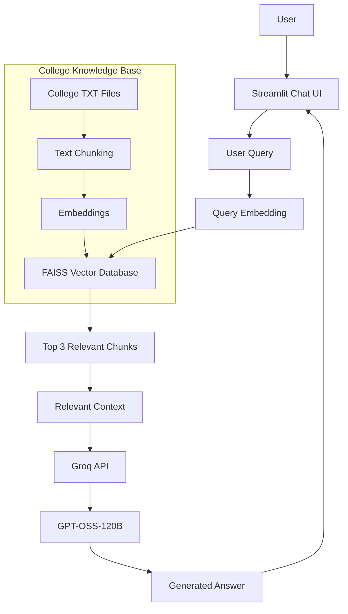

# 🎓 SVPM College Chatbot

🚀 **Live App:** https://eqorzm5g3pqxtraqrxtbbk.streamlit.app/

SVPM College Chatbot is an **AI-powered RAG-based FAQ chatbot** developed for SVPM's College of Engineering, Malegaon (Bk), Baramati.

It helps students and visitors get information about **admissions, departments, placements, facilities, scholarships, academics, and college contact details** using natural language questions.

The chatbot uses **RAG (Retrieval-Augmented Generation)** to retrieve relevant information from the college knowledge base before generating an answer with **GPT-OSS-120B through Groq API**.

---

### How It Works

1. User asks a question through the Streamlit chatbot.
2. The question is converted into an embedding using `all-MiniLM-L6-v2`.
3. FAISS searches the college knowledge base for relevant information.
4. The top relevant chunks are retrieved.
5. The retrieved information is sent to GPT-OSS-120B through Groq.
6. The chatbot generates and displays the answer.

---

## 💻 Technical Architecture Flow Chart



---

## ✨ Features

* 🎓 College FAQ chatbot
* 💡 Quick questions for common information
* 🔍 Semantic search using embeddings
* 🗂️ FAISS vector database
* 🤖 GPT-OSS-120B response generation
* 💬 Chat history
* 📚 College information knowledge base
* 🌐 Streamlit web interface
* 🚀 Deployed on Streamlit Cloud

---

## 🛠️ Technologies Used

* **Python**
* **Streamlit**
* **RAG**
* **Sentence Transformers**
* **FAISS**
* **Groq API**
* **GPT-OSS-120B**
* **GitHub**

---

## 📂 Project Structure

```text
-svpm-college-chatbot/
│
├── App.py
├── rag.py
├── requirements.txt
│
├── data/
│   ├── general.txt
│   ├── departments.txt
│   ├── admissions.txt
│   ├── placements.txt
│   ├── facilities.txt
│   ├── scholarships.txt
│   ├── academics.txt
│   └── committees_events.txt
│
└── README.md
```

---

## ⚙️ How to Run Locally

### 1. Clone the repository

```bash
git clone https://github.com/Gaurinavale/-svpm-college-chatbot.git
```

### 2. Install dependencies

```bash
pip install -r requirements.txt
```

### 3. Add Groq API Key

Create:

```text
.streamlit/secrets.toml
```

Add:

```toml
GROQ_API_KEY = "your_groq_api_key"
```

### 4. Run the application

```bash
streamlit run App.py
```

---

## 📚 Knowledge Base

The chatbot uses separate text files for:

* General college information
* Departments
* Admissions
* Placements
* Facilities
* Scholarships
* Academics
* Committees and events

These files are stored in the `data/` folder.

---

## 🎯 Project Goal

The goal of this project is to provide a simple and useful **AI-powered college information assistant** that can quickly retrieve relevant information and answer student queries.

---

## 👩‍💻 Author

**Gauri Navale**

AI/ML Engineer | GenAI & LLM Applications | RAG | Python

---

⭐ If you find this project useful, consider giving it a star on GitHub.
